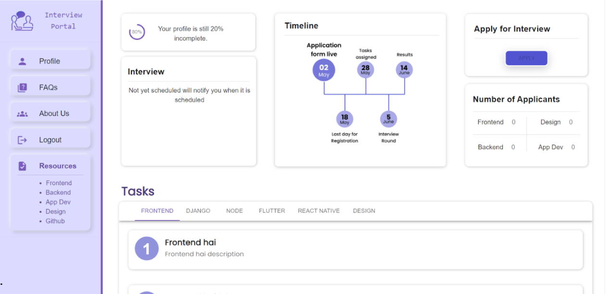
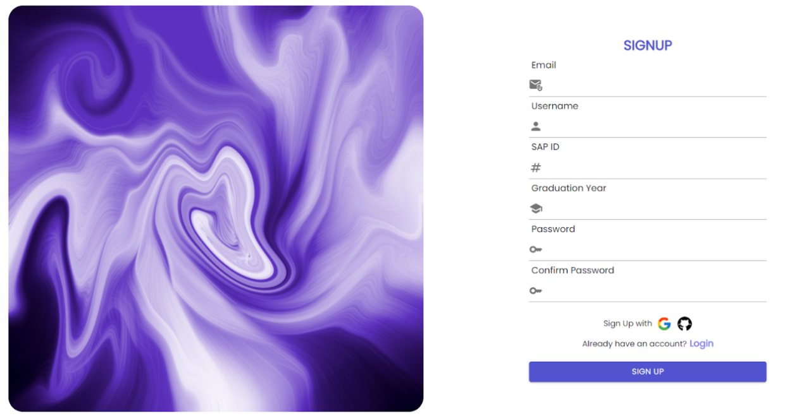
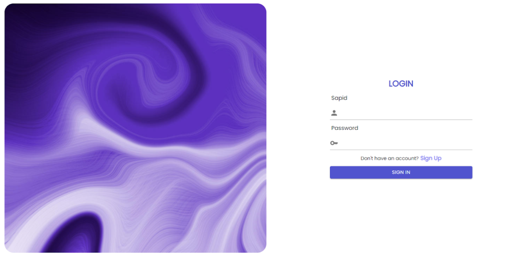
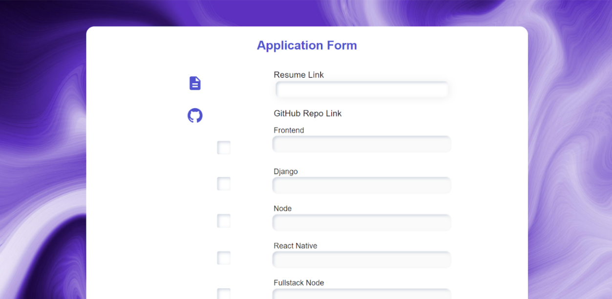
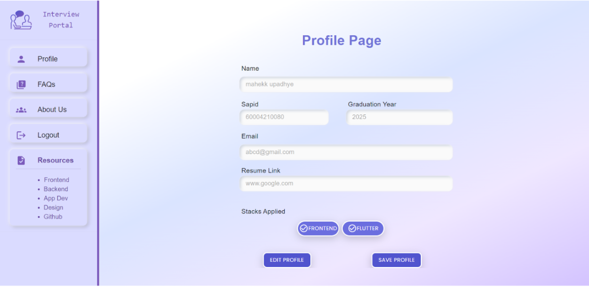
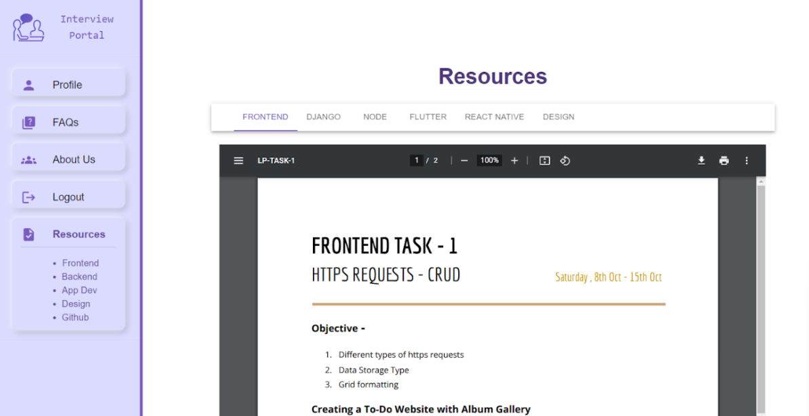
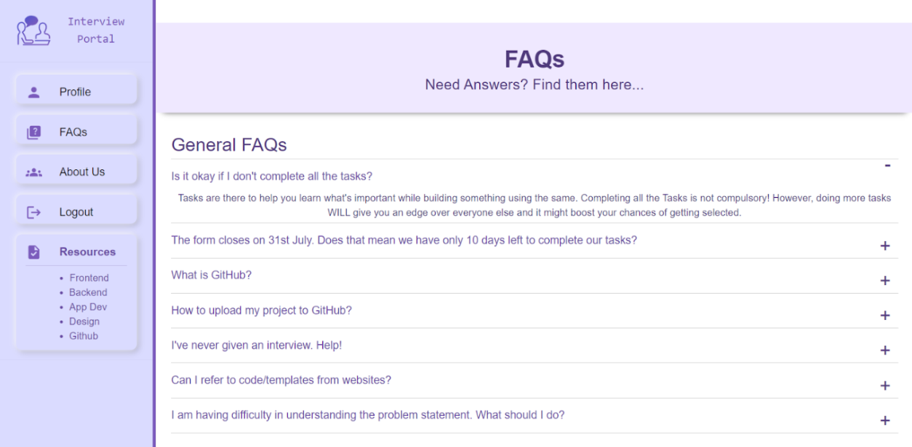
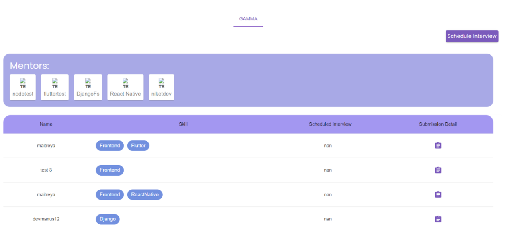
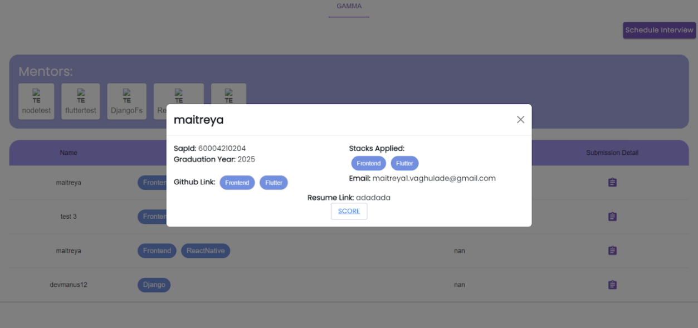

# Interview Portal

[](https://reactjs.org/)
[](https://www.djangoproject.com/)
[](https://opensource.org/licenses/MIT)

Interview Preparation Platform is a comprehensive tool for interview preparation, allowing candidates to register, apply for interviews, access resources, track their progress, and receive feedback — all in one place. It helps interviewees and recruiters streamline the application and interview process efficiently.

<p align="center">
  
</p>

## 🚀 Features

### Login and Signup
- Minimal fields for registration: full name, email, SAP ID, graduation year, and password.  
- Authentication via Token Authentication; login using SAP ID and password.

### Resources
- Central hub for tutorials, tools, and materials to improve interview skills.  
- Organized by categories: frontend, backend, app, and design.

### Application Form
- Candidates can submit applications with resume and GitHub links.  
- Collects all relevant information for interview scheduling.

### Dashboard
- Manage upcoming interviews, tasks, and preparation progress.  
- Includes progress tracker to monitor tasks and motivate users.

### FAQs
- Provides answers to common questions to prepare candidates and reduce inquiries.

### Interview Scheduling
- Allows interviewers to schedule interviews efficiently.  
- Reduces back-and-forth communication and ensures smooth scheduling.

### Marking System
- Recruiters can record evaluations and scores.  
- Can integrate with recruitment or HR systems.

### Additional Feedback
- Interviewers can provide personalized feedback to candidates.  
- Helps candidates improve and prepare better for future interviews.

## 🛠️ Tech Stack

- **Frontend:** React.js  
- **Backend:** Django  

## 📸 Demonstrations

### Interviewee Side

<p align="center">
  
</p>

<p align="center">
  
</p>

<p align="center">
  
</p>

<p align="center">
  
</p>

<p align="center">
  
</p>

<p align="center">
  
</p>

<p align="center">
  
</p>

### Interviewer Side

<p align="center">
  
</p>

<p align="center">
  
</p>

## ⚙️ Installation & Setup (Local)

### Clone the Repository
```bash
git clone https://github.com/username/repo-name.git
cd repo-name
```
### Frontend

```bash
cd frontend
npm install
```
### Backend

```bash
cd ../backend
pip install -r requirements.txt
```
### Create a .env file in the backend root

``` bash
SECRET_KEY=your_django_secret_key
DEBUG=True
DATABASE_URL=your_database_url
```
### Run the backend
``` bash
python manage.py runserver
```
### Run the frontend
```bash
npm start
```
## 🔗 Feature / API Endpoints

| Method   | Endpoint                   | Description                                     |
| -------- | -------------------------- | ----------------------------------------------- |
| **POST** | `/api/register/`           | Register a new user account                     |
| **POST** | `/api/login/`              | Login with SAP ID and password                  |
| **GET**  | `/api/resources/`          | Retrieve all categorized resources              |
| **POST** | `/api/application/`        | Submit interview application                    |
| **GET**  | `/api/dashboard/`          | View dashboard with progress and upcoming tasks |
| **POST** | `/api/schedule-interview/` | Schedule an interview for a candidate           |         |
| **POST** | `/api/feedback/`           | Provide additional feedback to interviewee      |
| **GET**  | `/api/faqs/`               | Retrieve frequently asked questions             |

## 👨‍💻 Contributors 
- [Mahek Upadhye](https://github.com/mahekupadhye31)
- [Vatsal Shah](https://github.com/vatsalshah041)
